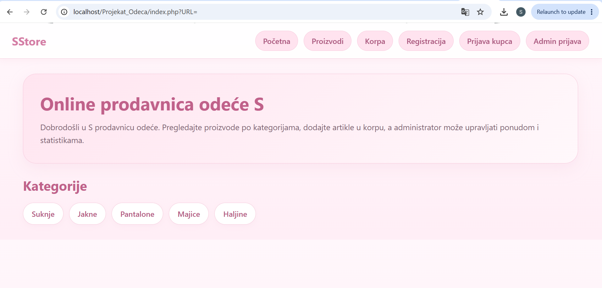
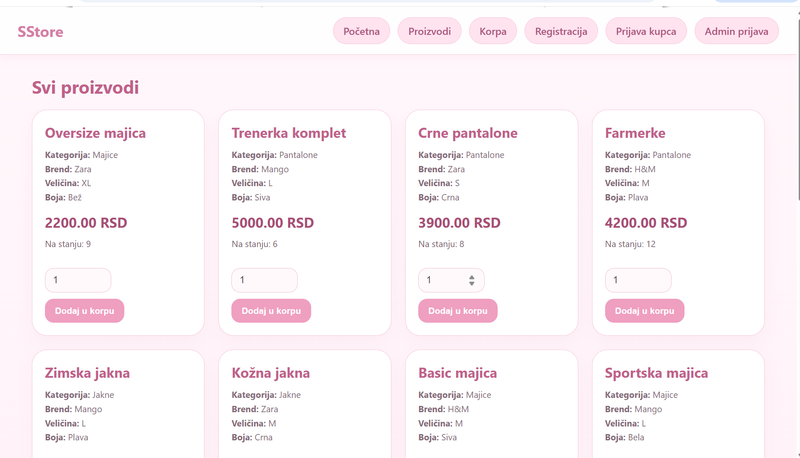
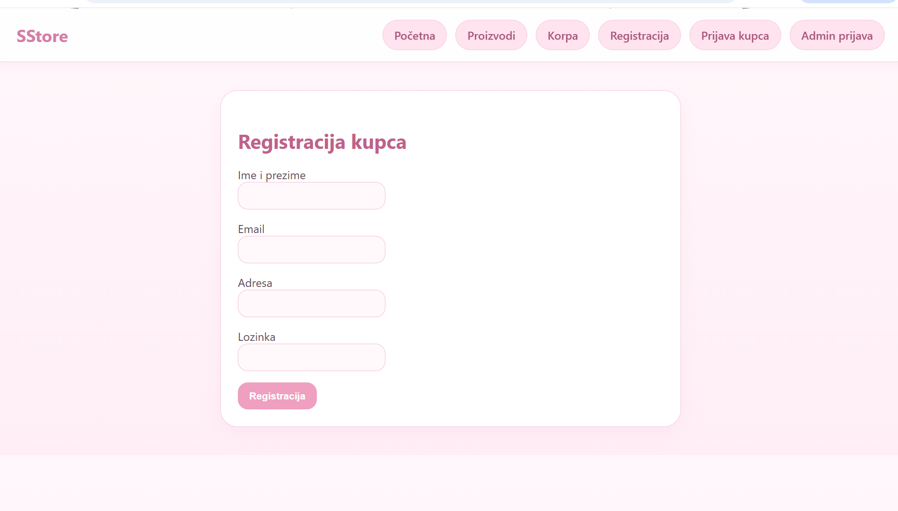
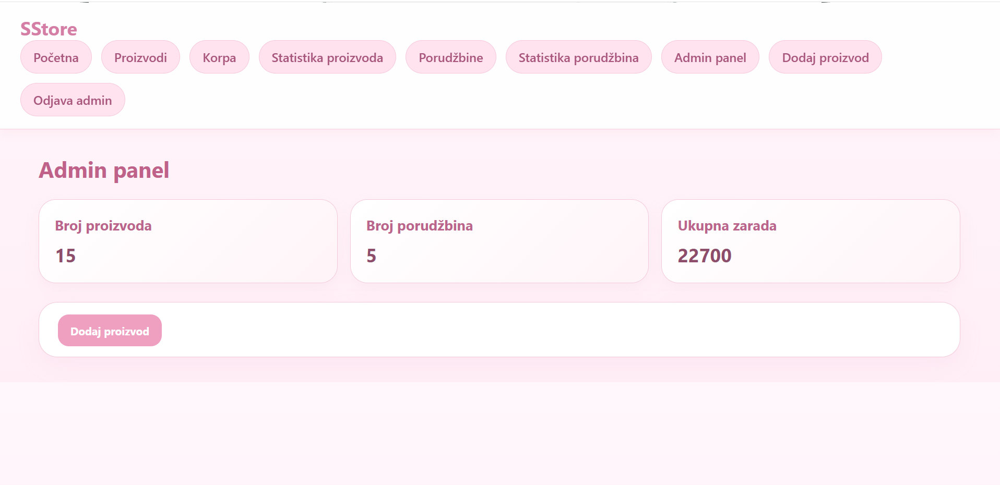

# PHP Clothing Store MVC

A full-stack PHP MVC web application for an online clothing store featuring authentication, admin dashboard, product management, shopping cart functionality, orders, statistics, and MySQL database integration.

---

## Features

- User authentication and admin login
- Product management system
- Shopping cart functionality
- Order management
- Statistics dashboard
- MySQL database integration
- MVC architecture
- Twig templating support
- Routing system
- CRUD operations
- Responsive web interface

---

## Technologies Used

- PHP
- MySQL
- Twig
- HTML/CSS
- MVC Architecture
- Composer

---

## Project Structure

```bash
Controllers/
Core/
Models/
Views/
public/
```

---

## Setup

### 1. Clone the repository

```bash
git clone https://github.com/saraaz1004/php-clothing-store-mvc.git
```

### 2. Install dependencies

```bash
composer install
```

### 3. Import the database

Import `database.sql` into MySQL using phpMyAdmin or MySQL CLI.

### 4. Configure database settings

Edit configuration files with your local database credentials.

### 5. Start the server

```bash
php -S localhost:8000
```

Open the application in your browser:

```bash
http://localhost/php-clothing-store-mvc
```

---

## Screenshots

### Home Page
Main landing page of the online clothing store with featured products and navigation.



---

### Product Catalog
Product browsing page with categories, filtering, and detailed product listings.



---

### Shopping Cart
Shopping cart system where users can manage selected products before checkout.



---

### Admin Dashboard
Administrative dashboard for managing products, orders, and store statistics.



---

## Learning Outcomes

Through this project, I improved my understanding of:

- Backend web development
- MVC architecture
- Database design and SQL
- Authentication systems
- CRUD operations
- PHP routing and templating
- Building scalable web applications
- Structuring maintainable backend systems

---

## Author

Sara Zivkovic
